#Week 2

#Funda
Voordat images ingeladen worden wordt nu een thumbnail geshowed zodat voor slome internet snelheden niet gewacht hoeft te
worden op de AJAX request.
Een fallback voor het niet laden van images is natuurlijk de alt maar met .onload events kunnen we de images manipuleren door images
nadat ze geladen worden pas de thumbnail te laten overwriten.

#Feature Detection

##HTML 5

* Audio

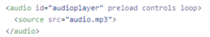
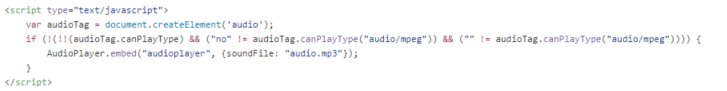

* Video

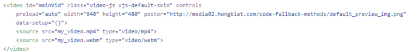

##CSS

* Flex box

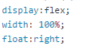

* Color 3 (Opacity)
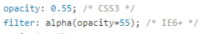

##JS

* Promise
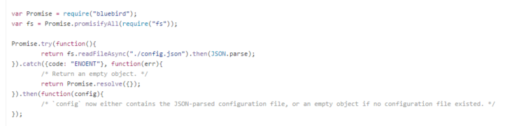

* Library (CDN)

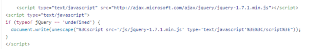

#Browser Technologies
TODO 1: Images worden momenteel met scrolling ingeladen, een handige change zou zijn om lazyloading voor mobile toe te voegen, alleen images inladen wanneer deze in het scherm zijn

TODO 2: No script error

TODO 3: Wanneer images niet geladen kunnen worden alsnog de tekst en titel geven van het huis. (DONE)

TODO 4: Divjes met huizen zijn niet met tab te selecteren, tabindex toevoegen (Beste zou zijn met A'tjes of buttons maar dit is voor later)(DONE)

TODO 5: Wanneer images op de PDP niet worden geladen laat fullscreen de informatie zien met nieuwe styling en zonder de popup css transition.

TODO 6: ARIA roles

TODO 7: Templating kan beter

TODO 8: Gebruik maken van de kleinere image sizes van funda wanneer internet sloom is

##Kleur
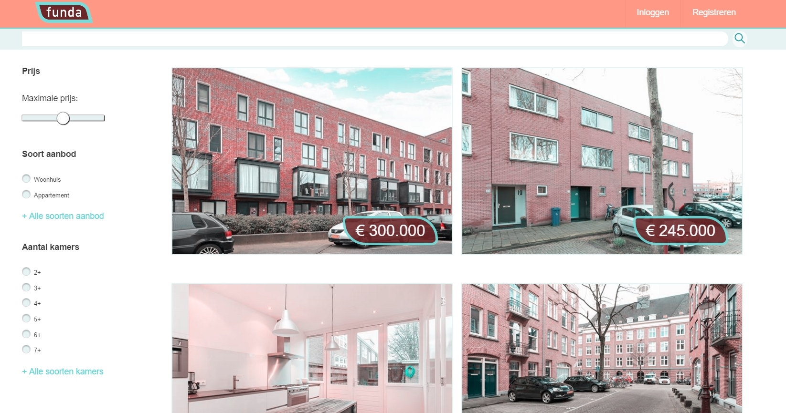
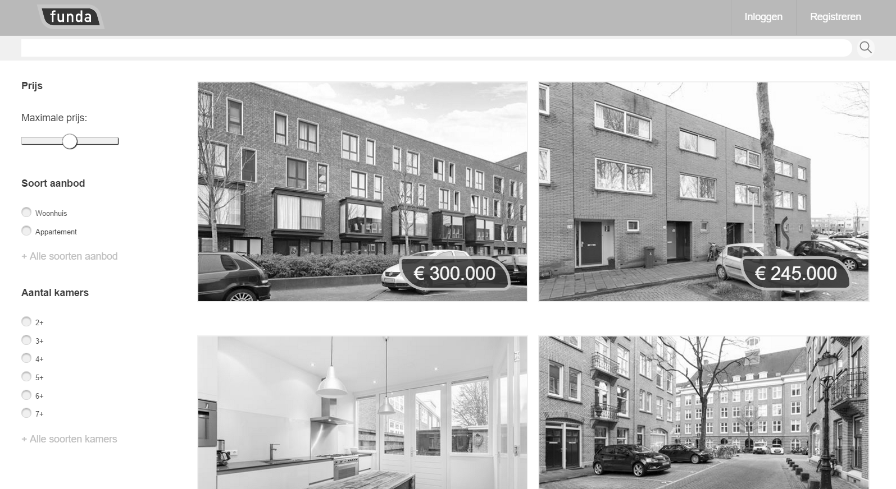

##Zonder JS
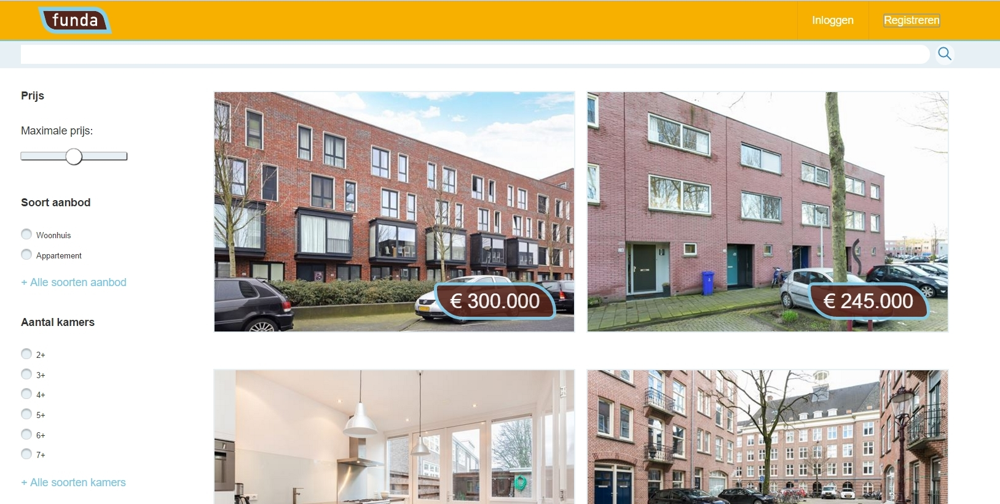
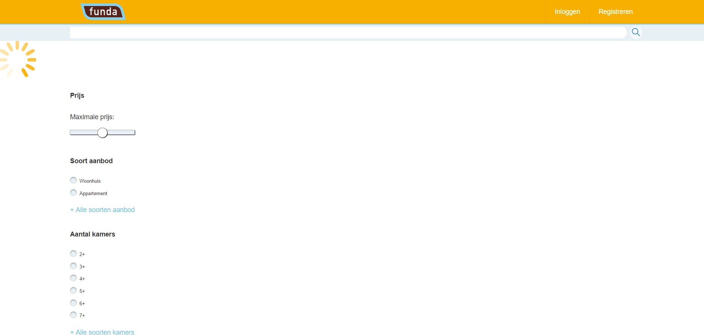

##Screenreader

Leest de searchbalk goed voor alleen de list view zoals verwacht niet, A'tjes voor elk huis zou natuurlijk het slimst zijn

##Breedband
Sloom!!

##CustomFonts/Cookies/CDN/Wifi 

N.v.t.

# Funda Project Week 1
#http://onwezen.github.io/Funda/
www.funda.nl/cmda-1

#Samenvatting Opdracht

Funda heeft ongeveer 70% mobiel/tablet gebruikers.
De site wordt gebouwd door ongeveer 50 developers.

Funda heeft nu als functionaliteit 2 vormen van zoeken:
De standaard lijst view en een zoek op kaart

Kunnen hier nieuwe zoekvormen aan toegevoegd worden?

Bezichting moet eigenlijk alleen bij veel interesse, hier moet Funda voor zorgen.
Welke informatie moet getoond worden? Denk ook aan criminaliteitscijfers die misschien onterecht zijn.

# API's:

#Zoekopdracht API
Max 25 resultaten
Pagina's, meerdere requests
Object GUID

#Autosuggest API
Input string

#Kaart API
Google Maps
X / Y / Zoomlevel
Geocoding

